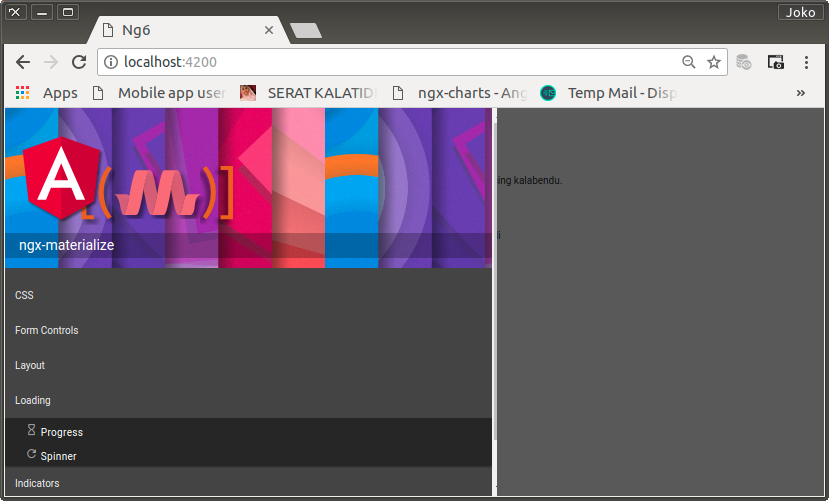

# Sidenavmenu

Side Navigator, adalah pusat dari semua sajian utama dari aplikasi ini, hampir semua sajian, dapat di temukan di sini. Workspace Sidenav berarti haruslah bersifat infinite dan metode penyajian yang paling cocok adalah sebuah collapsible component.

Pada titik ini harus dibuat sebuah collapsible dan sajiannya. Sajian masih static. Semua ditempatkan di template dan tentu saja belum dapat dirubah sajiannya saat runtime. Pada titik di mana kebutuhan untuk berperilaku dinamik muncul, static menu ini harus segera dirubah menjadi component yang bersifat dinamik.

## `SidenavmenuComponent`

```bash
$ ng generate component /features/components/sidenavmenu
```

Oleh angular-cli, `SidenavmenuComponent` yang terbentuk akan di-import secara otomatis oleh `FeaturesModule`. Developer tinggal meletakkannya di `SidenavComponent` template.

`SidenavComponent` template

```html
<div id="sidenav"
    [style.left.px]="x"
    (window:resize)="onResize()"
    (window:keyup)="onKeyUp($event)"
>
    <div id="dish-container">
        <div id="dish-wrapper"
            [style.right.px]="-scrollbarWidth"
        >
            <div id="dish-servant" class="grey darken-3 grey-text text-lighten-3">
                <app-sidenavheader></app-sidenavheader>
                + <app-sidenavmenu></app-sidenavmenu>
            </div>
        </div>
    </div>
    <div id="flap"
        (mousedown)="onTouchstart($event)"
        (mouseup)="onTouchend($event)"
        (panstart)="onPanStart($event)"
        (panleft)="onPanMove($event)"
        (panright)="onPanMove($event)"
        (panend)="onPanEnd($event)"
    >
        <div id="stripes"></div>
    </div>
</div>
```

## `MzCollapsible` Module

Materialize collapsible component wrapper, bernama `MzCollapsibleModule` di-import oleh `FeaturesModule`.

Import pula `MzButtonModule`, `MzIconModule`, dan `MzIconMdiModule` untuk pembuatan item-item sajian.

`FeatureModule`

```typescript
import { NgModule } from '@angular/core';
import { CommonModule } from '@angular/common';

+ import { MzCollapsibleModule } from 'ngx-materialize';
+ import { MzButtonModule } from 'ngx-materialize';
+ import { MzIconModule, MzIconMdiModule } from 'ngx-materialize';

import { LoremComponent } from './components/lorem/lorem.component';
import { SidenavComponent } from './components/sidenav/sidenav.component';
import { SidenavheaderComponent } from './components/sidenavheader/sidenavheader.component';
+ import { SidenavmenuComponent } from './components/sidenavmenu/sidenavmenu.component';

@NgModule({
  imports: [
    CommonModule,
    + MzCollapsibleModule,
    + MzButtonModule,
    + MzIconModule,
    + MzIconMdiModule
  ],
  declarations: [
    LoremComponent,
    SidenavComponent,
    SidenavheaderComponent,
    + SidenavmenuComponent
  ],
  exports: [
    LoremComponent,
    SidenavComponent
  ]
})
export class FeaturesModule { }
```

## Membangun `SidenavmenuComponent` template

> Agar selalu terpampang di browser's workspace, selama pengembangan ganti initial value `isCollapsed` di `SidenavComponent` class ke `false`.

`SidenavmenuComponent` template

```html
<mz-collapsible [mode]="'expandable'">
  <mz-collapsible-item>
    <mz-collapsible-item-header>
      CSS
    </mz-collapsible-item-header>
    <mz-collapsible-item-body>
        <a mz-button 
          class="fullwidth grey darken-4 white-text btn-flat"
          (mouseup)="onCSS(0, $event)"> 
          <i mz-icon 
            class="grey-text"
            [align]="'left'"
            [icon]="'colorize'"
            [size]="'medium'">
          </i>
          Color
        </a>
        <a mz-button 
          class="fullwidth grey darken-4 white-text btn-flat"
          (mouseup)="onCSS(1, $event)"> 
          <i mz-icon 
            class="grey-text"
            [align]="'left'"
            [icon]="'border_clear'"
            [size]="'medium'">
          </i>
          Grid
        </a>
        <a mz-button 
          class="fullwidth grey darken-4 white-text btn-flat"
          (mouseup)="onCSS(2, $event)"> 
          <i mz-icon 
            class="grey-text"
            [align]="'left'"
            [icon]="'aspect_ratio'"
            [size]="'medium'">
          </i>
          Helpers
        </a>
        <a mz-button 
          class="fullwidth grey darken-4 white-text btn-flat"
          (mouseup)="onCSS(3, $event)"> 
          <i mz-icon 
            class="grey-text"
            [align]="'left'"
            [icon]="'burst_mode'"
            [size]="'medium'">
          </i>
          Media
        </a>
        <a mz-button 
          class="fullwidth grey darken-4 white-text btn-flat"
          (mouseup)="onCSS(4, $event)"> 
          <i mz-icon 
            class="grey-text"
            [align]="'left'"
            [icon]="'leak_add'"
            [size]="'medium'">
          </i>
          Pulse
        </a>
        <a mz-button 
          class="fullwidth grey darken-4 white-text btn-flat"
          (mouseup)="onCSS(5, $event)"> 
          <div id="sass-icon">
          Sass
          </div>
        </a>
        <a mz-button 
        class="fullwidth grey darken-4 white-text btn-flat"
        (mouseup)="onCSS(6, $event)"> 
        <i mz-icon 
          class="grey-text"
          [align]="'left'"
          [icon]="'collections'"
          [size]="'medium'">
        </i>
        Shadow
      </a>
      <a mz-button 
        class="fullwidth grey darken-4 white-text btn-flat"
        (mouseup)="onCSS(7, $event)"> 
        <i mz-icon 
          class="grey-text"
          [align]="'left'"
          [icon]="'border_all'"
          [size]="'medium'">
        </i>
        Table
      </a>
      <a mz-button 
        class="fullwidth grey darken-4 white-text btn-flat"
        (mouseup)="onCSS(8, $event)"> 
        <i mz-icon 
          class="grey-text"
          [align]="'left'"
          [icon]="'compare_arrows'"
          [size]="'medium'">
        </i>
        Transitions
      </a>
      <a mz-button 
        class="fullwidth grey darken-4 white-text btn-flat"
        (mouseup)="onCSS(9, $event)"> 
        <i mz-icon 
          class="grey-text"
          [align]="'left'"
          [icon]="'spellcheck'"
          [size]="'medium'">
        </i>
        Typhography
      </a>
    </mz-collapsible-item-body>
  </mz-collapsible-item>
  <mz-collapsible-item>
    <mz-collapsible-item-header>
      Form Controls 
    </mz-collapsible-item-header>
    <mz-collapsible-item-body>
      <a mz-button 
        class="fullwidth grey darken-4 white-text btn-flat"
        (mouseup)="onForm(0, $event)"> 
        <i mz-icon 
          class="grey-text"
          [align]="'left'"
          [icon]="'crop_16_9'"
          [size]="'medium'">
        </i>
        Button
      </a>
      <a mz-button 
        class="fullwidth grey darken-4 white-text btn-flat"
        (mouseup)="onForm(1, $event)"> 
        <i mz-icon 
          class="grey-text"
          [align]="'left'"
          [icon]="'check_box'"
          [size]="'medium'">
        </i>
        Checkbox
      </a>
      <a mz-button 
        class="fullwidth grey darken-4 white-text btn-flat"
        (mouseup)="onForm(2, $event)"> 
        <i mz-icon 
          class="grey-text"
          [align]="'left'"
          [icon]="'local_offer'"
          [size]="'medium'">
        </i>
        Chip
      </a>
      <a mz-button 
        class="fullwidth grey darken-4 white-text btn-flat"
        (mouseup)="onForm(3, $event)"> 
        <i mz-icon 
          class="grey-text"
          [align]="'left'"
          [icon]="'event_available'"
          [size]="'medium'">
        </i>
        Datepicker
      </a>
      <a mz-button 
        class="fullwidth grey darken-4 white-text btn-flat"
        (mouseup)="onForm(4, $event)"> 
        <i mz-icon 
          class="grey-text"
          [align]="'left'"
          [icon]="'assignment_turned_in'"
          [size]="'medium'">
        </i>
        Form Validation
      </a>
      <a mz-button 
        class="fullwidth grey darken-4 white-text btn-flat"
        (mouseup)="onForm(5, $event)"> 
        <i mz-icon 
          class="grey-text"
          [align]="'left'"
          [icon]="'assignment_turned_in'"
          [size]="'medium'">
        </i>
        Input
      </a>
      <a mz-button 
        class="fullwidth grey darken-4 white-text btn-flat"
        (mouseup)="onForm(6, $event)"> 
        <i mz-icon 
          class="grey-text"
          [align]="'left'"
          [icon]="'radio_button_checked'"
          [size]="'medium'">
        </i>
        Radio Button
      </a>
      <a mz-button 
        class="fullwidth grey darken-4 white-text btn-flat"
        (mouseup)="onForm(7, $event)"> 
        <i mz-icon 
          class="grey-text"
          [align]="'left'"
          [icon]="'change_history'"
          [size]="'medium'">
        </i>
        Select
      </a>
      <a mz-button 
        class="fullwidth grey darken-4 white-text btn-flat"
        (mouseup)="onForm(8, $event)"> 
        <div id="switch-icon">
        Switch
        </div>
      </a>
      <a mz-button 
        class="fullwidth grey darken-4 white-text btn-flat"
        (mouseup)="onForm(9, $event)"> 
        <i mz-icon 
          class="grey-text"
          [align]="'left'"
          [icon]="'tab_unselected'"
          [size]="'medium'">
        </i>
        Text Area
      </a>
      <a mz-button 
        class="fullwidth grey darken-4 white-text btn-flat"
        (mouseup)="onForm(10, $event)"> 
        <i mz-icon 
          class="grey-text"
          [align]="'left'"
          [icon]="'access_alarms'"
          [size]="'medium'">
        </i>
        Timepicker
      </a>
    </mz-collapsible-item-body>
  </mz-collapsible-item>
  <mz-collapsible-item>
    <mz-collapsible-item-header>
      Layout
    </mz-collapsible-item-header>
    <mz-collapsible-item-body>
      <a mz-button 
        class="fullwidth grey darken-4 white-text btn-flat"
        (mouseup)="onLayout(0, $event)"> 
        <i mz-icon 
          class="grey-text"
          [align]="'left'"
          [icon]="'style'"
          [size]="'medium'">
        </i>
        Card
      </a>
      <a mz-button 
        class="fullwidth grey darken-4 white-text btn-flat"
        (mouseup)="onLayout(1, $event)"> 
        <div id="collapsible-icon">
        Collapsible
        </div>
      </a>
      <a mz-button 
        class="fullwidth grey darken-4 white-text btn-flat"
        (mouseup)="onLayout(2, $event)"> 
        <i mz-icon 
          class="grey-text"
          [align]="'left'"
          [icon]="'dehaze'"
          [size]="'medium'">
        </i>
        Collection
      </a>
      <a mz-button 
        class="fullwidth grey darken-4 white-text btn-flat"
        (mouseup)="onLayout(3, $event)"> 
        <i mz-icon 
          class="grey-text"
          [align]="'left'"
          [icon]="'more_vert'"
          [size]="'medium'">
        </i>
        Dropdown
      </a>
      <a mz-button 
        class="fullwidth grey darken-4 white-text btn-flat"
        (mouseup)="onLayout(4, $event)"> 
        <i mz-icon 
          class="grey-text"
          [align]="'left'"
          [icon]="'library_books'"
          [size]="'medium'">
        </i>
        Modal
      </a>
      <a mz-button 
        class="fullwidth grey darken-4 white-text btn-flat"
        (mouseup)="onLayout(5, $event)"> 
        <i mz-icon 
          class="grey-text"
          [align]="'left'"
          [icon]="'linear_scale'"
          [size]="'medium'">
        </i>
        Navbar
      </a>
      <a mz-button 
        class="fullwidth grey darken-4 white-text btn-flat"
        (mouseup)="onLayout(6, $event)"> 
        <i mz-icon 
          class="grey-text"
          [align]="'left'"
          [icon]="'import_contacts'"
          [size]="'medium'">
        </i>
        Pagination
      </a>
      <a mz-button 
        class="fullwidth grey darken-4 white-text btn-flat"
        (mouseup)="onLayout(7, $event)"> 
        <i mz-icon 
          class="grey-text"
          [align]="'left'"
          [icon]="'burst_mode'"
          [size]="'medium'">
        </i>
        Paralax
      </a>
      <a mz-button 
        class="fullwidth grey darken-4 white-text btn-flat"
        (mouseup)="onLayout(8, $event)"> 
        <i mz-icon 
          class="grey-text"
          [align]="'left'"
          [icon]="'image'"
          [size]="'medium'">
        </i>
        Sidenav
      </a>
      <a mz-button 
        class="fullwidth grey darken-4 white-text btn-flat"
        (mouseup)="onLayout(9, $event)"> 
        <i mz-icon 
          class="grey-text"
          [align]="'burst_mode'"
          [icon]="'power_input'"
          [size]="'medium'">
        </i>
        Tab
      </a>
    </mz-collapsible-item-body>
  </mz-collapsible-item>
  <mz-collapsible-item>
    <mz-collapsible-item-header>
      Loading
    </mz-collapsible-item-header>
    <mz-collapsible-item-body>
      <a mz-button 
        class="fullwidth grey darken-4 white-text btn-flat"
        (mouseup)="onLoading(0, $event)"> 
        <i mz-icon 
          class="grey-text"
          [align]="'burst_mode'"
          [icon]="'hourglass_empty'"
          [size]="'medium'">
        </i>
        Progress
      </a>
      <a mz-button 
        class="fullwidth grey darken-4 white-text btn-flat"
        (mouseup)="onLoading(1, $event)"> 
        <i mz-icon 
          class="grey-text"
          [align]="'burst_mode'"
          [icon]="'refresh'"
          [size]="'medium'">
        </i>
        Spinner
      </a>
    </mz-collapsible-item-body>
  </mz-collapsible-item>
  <mz-collapsible-item>
    <mz-collapsible-item-header>
      Indicators
    </mz-collapsible-item-header>
    <mz-collapsible-item-body>
      <a mz-button 
        class="fullwidth grey darken-4 white-text btn-flat"
        (mouseup)="onIndicators(0, $event)"> 
        <i mz-icon 
          class="grey-text"
          [align]="'burst_mode'"
          [icon]="'filter_9'"
          [size]="'medium'">
        </i>
        Badge
      </a>
      <a mz-button 
        class="fullwidth grey darken-4 white-text btn-flat"
        (mouseup)="onIndicators(1, $event)"> 
        <i mz-icon 
          class="grey-text"
          [align]="'burst_mode'"
          [icon]="'looks'"
          [size]="'medium'">
        </i>
        Feature Discovery
      </a>
      <a mz-button 
        class="fullwidth grey darken-4 white-text btn-flat"
        (mouseup)="onIndicators(2, $event)"> 
        <i mz-icon 
          class="grey-text"
          [align]="'burst_mode'"
          [icon]="'adb'"
          [size]="'medium'">
        </i>
        Icon
      </a>
      <a mz-button 
        class="fullwidth grey darken-4 white-text btn-flat"
        (mouseup)="onIndicators(3, $event)"> 
        <i mz-icon 
          class="grey-text"
          [align]="'burst_mode'"
          [icon]="'filter_frames'"
          [size]="'medium'">
        </i>
        Toast
      </a>
      <a mz-button 
        class="fullwidth grey darken-4 white-text btn-flat"
        (mouseup)="onIndicators(4, $event)"> 
        <i mz-icon 
          class="grey-text"
          [align]="'burst_mode'"
          [icon]="'assistant'"
          [size]="'medium'">
        </i>
        Tooltip
      </a>
    </mz-collapsible-item-body>
  </mz-collapsible-item>
  <mz-collapsible-item>
    <mz-collapsible-item-header>
      Service
    </mz-collapsible-item-header>
    <mz-collapsible-item-body>
      <a mz-button 
        class="fullwidth grey darken-4 white-text btn-flat"
        (mouseup)="onService(0, $event)"> 
        <i mz-icon 
          class="grey-text"
          [align]="'burst_mode'"
          [icon]="'ondemand_video'"
          [size]="'medium'">
        </i>
        Media
      </a>
    </mz-collapsible-item-body>
  </mz-collapsible-item>
</mz-collapsible>
```

Jadi, template ini berstruktur sebagai berikut

`SidenavmenuComponent`

```html
<!--
Pengetahuan tentang ngx-materialize belum penuh sehingga terjadi issue yang
tidak resolved dengan cara yang benar. Untuk saat ini resolving dilakukan
dengan cara mengganti `materialize.min.css` reference dengan `materialize.css` dengan cara mengganti configuration property value tentang hal itu di `angular.json` dan kemudian melakukan patching ke `materialize.css`.

Issue:
    Tidak dapat melakukan css-overwrite dalam rangka untuk merubah collapsible background-color.
    Resolve:
        Meniadakan isi css-class `.collapsible` pada line 5719..dst sehingga
        `.collapsible` menjadi transparent. Sehingga background-color menjadi
        tergantung dari induk `.collapsible`, yaitu `#dish-servant` yang berada di `SidenavComponent` template.

        5719 .collapsible {
                /* 
                border-top: 1px solid #ddd;
                border-right: 1px solid #ddd;
                border-left: 1px solid #ddd;
                */
                /* margin: 0.5rem 0 1rem 0; */
            }
Issue:
    Tidak dapat melakukan css-overwrite dalam rangka untuk merubah classes collapsible-header dan collapsible-body
    Resolve:
        Patching pada `materialize.css` line 5728 (5737..5738), menghilangkan
        background-color dan border-bottom.

        5728 .collapsible-header {
                display: -webkit-box;
                display: -webkit-flex;
                display: -ms-flexbox;
                display: flex;
                cursor: pointer;
                -webkit-tap-highlight-color: transparent;
                line-height: 1.5;
                padding: 1rem;
        5737    /* background-color: #fff; */
                /* border-bottom: 1px solid #ddd; */
             }

        5749 .collapsible-body {
                display: none;
                /* border-bottom: 1px solid #ddd; */
                -webkit-box-sizing: border-box;
                        box-sizing: border-box;
                /* padding: 2rem; */
                padding: 0;
             }

-->
<mz-collapsible [mode]="'expandable'"> <!-- collapsible wrapper -->
    <mz-collapsible-item> <!-- wrapper per item -->
        <mz-collapsible-item-header> <!-- header untuk per item -->
            CSS
        </mz-collapsible-item-header>
        <mz-collapsible-item-body> <!-- wrapper untuk seluruh body -->
            <!-- 
            Hakekatnya isi dari item-body bisa apa saja. Dalam konteks ini 
            diisi dengan item-target untuk setiap sajian.

            Di sini, sajian dibuat dengan menggunakan link-button.
            Sajian selalu diawali dengan sebuah mdi-icon.
            -->
            <a mz-button 
            class="fullwidth grey darken-4 white-text btn-flat"
            (mouseup)="onCSS(0, $event)"> 
            <i mz-icon 
                class="grey-text"
                [align]="'left'"
                [icon]="'colorize'"
                [size]="'medium'">
            </i>
            Color
            </a>
            <!-- 
            Untuk icon yang tidak dapat dipenuhi oleh font mdi-icon,
            icon diganti dengan svg icon yang diatur lewat css sebagai background. Bukan dengan img-selector.
            -->
            <a mz-button 
                class="fullwidth grey darken-4 white-text btn-flat"
                (mouseup)="onCSS(5, $event)"> 
                <div id="sass-icon">
                Sass
                </div>
            </a>
        <mz-collapsible-item-body>
    </mz-collapsible-item>
</mz-collapsible>
```

<p align="center">
	
    <br />
    Figure: 007-a-sidemenu.png
</p>