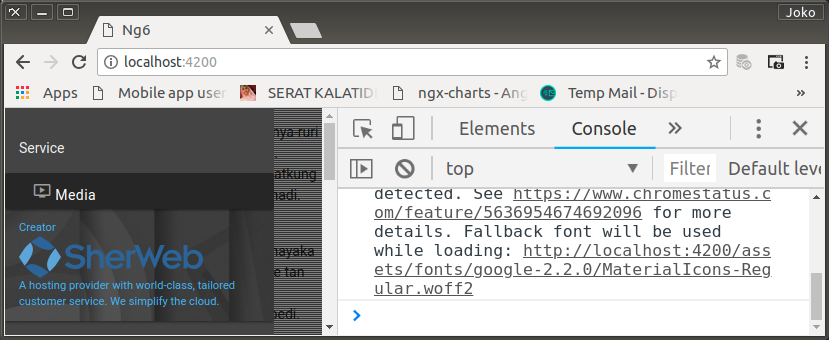

# Sidenav Footer

Side Navigator juga memiliki footer. Digunakan untuk menampilkan informasi apapun. Termasuk informasi yang memiliki link.

## Generate

```bash
$ ng generate component /features/sidenavfooter
```

Karena pertimbangan peletakan visual, tidak sebagaimana `SidenavHeaderComponent` dan `SidenavmenuComponent` yang langsung diadopsi oleh `SidenavComponent`, component ini diadopsi oleh `SidenavmenuComponent` dengan meletakkan selectornya di bagian bawah menu terbawah, menjadi sibling dari `<mz-collapsible-item>`.


`SidenavmenuComponent` template snippet.

```html
                        ...
                    </i>
                    Media
                </a>
            </mz-collapsible-item-body>
        </mz-collapsible-item>
    <app-sidenavfooter></app-sidenavfooter>
</mz-collapsible>
```

## `SidenavfooterComponent`

`SidenavfooterComponent` template

```html
<div id="sidenavfooter" class="valign-wrapper">
    <div class="blue-text text-lighten-2">
        <div id="creator">Creator</div>
        <div id="sherweb-logo"></div>
        <div id="sherweb-slogan">
            A hosting provider with world-class, tailored customer service. We simplify the cloud.
        </div>
    </div>
</div>
```

`SidenavfooterComponent` style

```css
#sidenavfooter {
    position: relative;
    width: 100%; height: 8em; padding-left: 1em;
    background-image: url(/assets/images/nav/footer-background/v0.jpg);
    background-size: auto 16em;
    background-repeat: repeat-x;
    text-align: bottom;
}
#creator {
    font-size: 0.8em;
}
#sherweb-logo {
    max-width: 80%; height: 3em;
    background-image: url(/assets/images/nav/sherweb-logo/v0.svg);
    background-size: auto 3em;
    background-position: bottom left;
    background-repeat: no-repeat;
}
#sherweb-slogan {
    width: 100%; font-size: 0.8em;
}
```

<p align="center">
	
    <br />
    Figure: 008-a-sidemenufooter.png
</p>